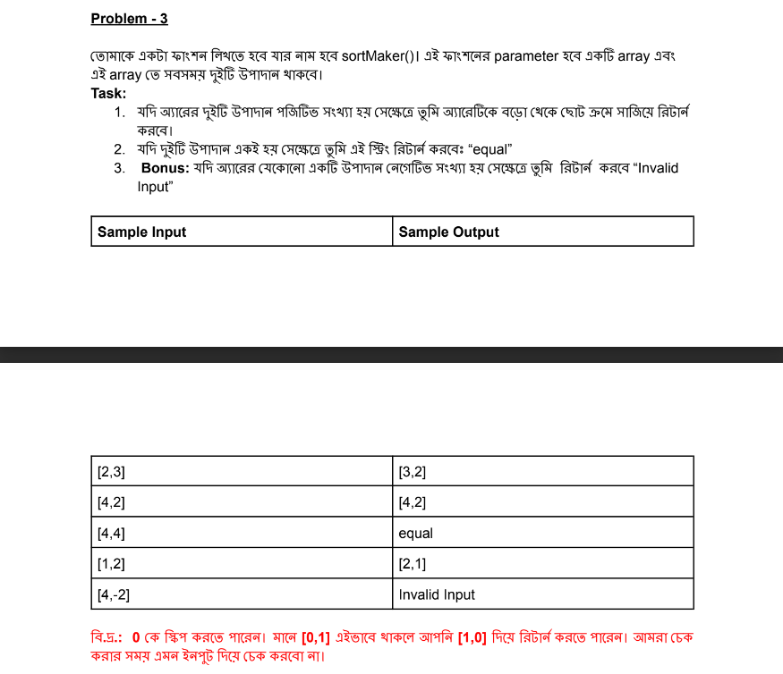

# Table of contents
- [Assignment-4 batch-8](#assignment-4-batch-8)
- [Assignment-4 batch-7](#assignment-4-batch-7)

# Take Challenges: Be a problem Solver

# Assignment-4 batch-8
1. Problem-1:
- 
```sh
function cubeNumber(number) {
    if(typeof number !=='number')
    {
      return 'Please enter a number';
    }else{
        const num= number**3;
        return num;
        }
}
const num="asf";
const result=cubeNumber(num);
console.log(result);
```
2. Problem-2:
- 
```sh
function matchFinder(string1, string2) {
    if (typeof string1 !== 'string' || typeof string2 !== 'string') {
        return 'Please enter both strings as input.';
    } else {
        const doesExist = string1.toLowerCase().includes(string2.toLowerCase());
        return doesExist;
    }
}

const getString1 = 'hi, I am Bariul';
const getString2 = 'be';
console.log(matchFinder(getString1, getString2)); 
```
3. Problem-3:
- 
```sh
function sortMaker(arr) {
    if(0<arr[0,1] && arr[0]!=arr[1]  ){
        return arr.sort(function(a, b){return b-a});
    }else if(arr[0]==arr[1]){
        return "equal";
    }else{
        return 'Invalid input';
    }
}
console.log(sortMaker([55,-55]))
```
4. Problem-4:
- 
```sh
function findAddress(obj) {
    const properties = ['street', 'House', 'society'];
    const formattedObj = properties.map((key) => (obj[key] ? obj[key] : '__'));
    return formattedObj.join(',');
 }
 
 const inputObject = { street: 'ROAD-1', House: '32', society: 'g' };
 const output = findAddress(inputObject);
 console.log(output); 
```
5. Problem-5:
- 
```sh
function canPay(changeArray,totalDue  ) {
    if (!changeArray.length){
      console.log('Please come with money');
    }else{
      total=0;
      for(let i=0;i<changeArray.length;i++){
        const taka=changeArray[i];
        total=total+taka;
      }
      if(total>=totalDue){
        return true;
      }else{
        return false;
      }
    }
    }
    const arr=[]
    const num=10;
    console.log(canPay(arr,num)) 
```

# Assignment-4 batch-7
1. Problem-1:
Let’s play a mind game.
তোমাকে একটা function দেওয়া হবে called mindGame(” যা ইনপুট হিসেবে একটা positive number নিবে।")এখন তোমার task : তোমাকে সেই নাম্বার এর সাথে 3 গুন করে, তারপর 10 যোগ করে, তারপর 2 দিয়ে ভাগ করে, তারপর 5 বিয়োগ করে, যা আউটপুট আসবে তা return করতে হবে

Sample Input & Output
Input: 5
Output: 7.5

Input: 50
Output: 75

Input: 33
Output: 49.5 
```sh
/*Function-Description:
This function working with mathematical operation */
function mindGame(positiveNumber){
  
  if(typeof positiveNumber !=='number')
  {
    return 'Please enter a number';
  }else{
  let total=(positiveNumber*3+10)/2-5;
  return total;
  }
}        
const total=mindGame(33);
console.log(total);
```
2. Problem-2: 
Finding even or odd
তোমাকে একটা function দেওয়া হবে called evenOdd(). এটা ইনপুট হিসেবে একটা string নিবে।এখন তোমার task: String এ total কয়টা character আছে তার উপর ভিত্তি করে আউটপুট দিতে হবে। আউটপুট হবে ‘even’ অথবা ‘odd’ ।Sample 

Input: ‘Phero’
Output: odd
Input: ‘Batch7’
Output: even
Input: ‘chatgpt’
Output: odd */
```sh
/*Function-Description:
This function working with conditon statement  */
function evenOdd(text){ 
    if(typeof text !=='string')
    {
      return 'Please enter a string';
    }else{
      let length = text.length;
    if(length%2!==0){
      return 'odd';
    }
    else{
      return 'even';
    }
  }
  }  
  let text = 'Phero';
  let myResult=evenOdd(text);
  console.log(myResult);
```
3. Problem-3: 
Is Less or Greater than seven
তোমাকে একটা function দেওয়া হবে called “isLGSeven()”. এটা ইনপুট হিসেবে একটা number নিবে। এখন তোমার task: তোমাকে ইনপুট ভ্যালু এবং ৭ এর মধ্যে পার্থক্য বের করতে হবে। যদি এই পার্থক্য ৭ এর চেয়ে ছোট হয়, তখন তোমাকে return করতে হবে সেই বিয়োগফল। নাহলে তোমাকে return করতে হবে double of the input। মানে যে সংখ্যা ইনপুট হিসেবে নিয়েছো সেটির দ্বিগুণ।

Input : 6

Output: -1

Input: -15O utput: -22 Input: 15 Output: 30 */
```sh
/*Function-Description:
This function working with condition and return value from the each condition */
function isLGSeven(number){ 
  if(typeof number !=='number')
  {
    return 'Please enter a number';
  }else{
    if(number<7){
      return -7+number;
    }
    else{
      return 2*number;
    }
  }
}
let getNum=6;
let result=isLGSeven(getNum);
console.log(result);
```
4. Problem-4: 
Finding Bad data
তোমাকে একটা function দেওয়া হবে called findingBadData(). এটা ইনপুট হিসেবে একটা array নিবে। array তে যেকোনো সংখ্যক কতগুলো number থাকবে। number গুলো negative number (less than zero) ও হতে পারে, আবার positive number (greater than or equal to zero) ও হতে পারে। কোনও number যদি negative হয় সেটাকে আমরা বলব “Bad Data”. কোনও number যদি positive হয় সেটাকে আমরা বলব “Good Data”. 

এখন তোমার task: array তে কতগুলো Bad data আছে সেটা খুঁজে বের করতে হবে এবং সেই নাম্বার টা return করতে হবে।
Sample Input & Output:-
Input: [ 1,2,5 ]
Output: 0

Input: [ 2, -5, -7, -13 ]
Output: 3

Input: [ -4, -9, -5, -33, -55 ]
Output: 5
```sh
/*Function-Description:
This function working with loop and condion statement task */
function findingBadData(arr) {
  if(Array.isArray(arr))
  {
    let count = 0;
  for (let i = 0; i < arr.length; i++) {
    if (arr[i] < 0) {
      count++;
    }
  }
  return count;
  }else{
    return 'Please enter a Array';
  }
}
const arr = [1, -2, -3, 4, -5, 6, -7];
// const arr = 2;
console.log(findingBadData(arr)); 
```

5. Problem-5: 
Convert your gems into diamond
তোমাকে একটা function দেওয়া হবে called gemsToDiamond(). এটা ইনপুট হিসেবে তিনটা number ( তোমাদের ৩ বন্ধুর gems এর সংখ্যা ) নিবে। 

১ম বন্ধুর প্রতি gems এর ক্ষমতা = 21

২য় বন্ধুর প্রতি gems এর ক্ষমতা = 32

৩য় বন্ধুর প্রতি gems এর ক্ষমতা = 43

[ gems এর ক্ষমতা বলতে একটা gems কে কয়টা diamond এ convert করা যাবে সেটা বুঝানো হচ্ছে। ]

এখন তোমার task: সব বন্ধুর gems মিলিয়ে total কতটি diamond পাবে সেটা বের করতে হবে। total diamond এর সংখ্যা যদি 1000 এর দিগুন এর উপর হয়ে যায় সেক্ষেত্রে total diamond থেকে 2000 বাদ দিয়ে যতগুলো diamond অবশিষ্ট থাকবে, ততগুলো তোমরা পাবে।
Sample Input & Output:-
Input: 1, 1, 1
Output: 96

Input: 20, 200, 50
Output: 6970

Input: 100, 5, 1
Output: 303
```sh
/*Function-Description:
This function working with simple mathematical operationa and conditional statement togeter */
function gemsToDiamond(num1,num2,num3){
  if(typeof num1 !=='number' || typeof num2 !=='number' || typeof num3 !=='number')
  {
    return 'Please enter  numbers';
  }
  else{
  // return num1+num2; 
    let firstFriend=num1*21;
  let secondFriend=num2*32;
  let thirdFriend=num3*43;
  let total=firstFriend+secondFriend+thirdFriend; 
  if(total>1000*2){
    return total-2000;
  }   
  return total;
}
}
let num1=100;
let num2=5;
let num3=1;
let myResult2=gemsToDiamond(num1,num2,num3);
console.log(myResult2)
```