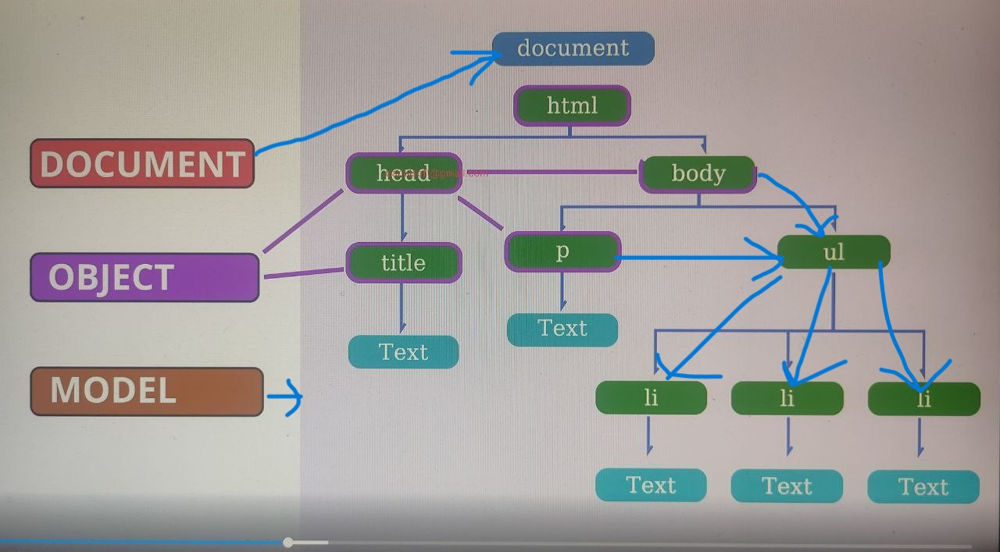
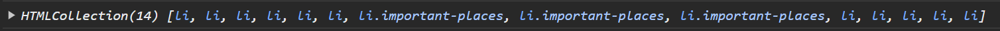
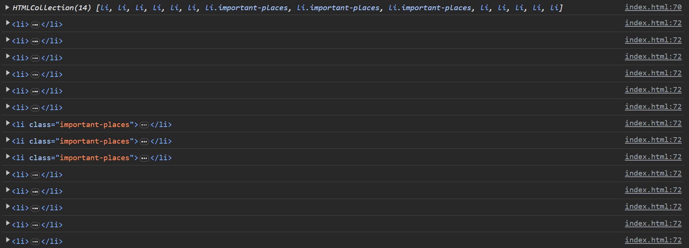
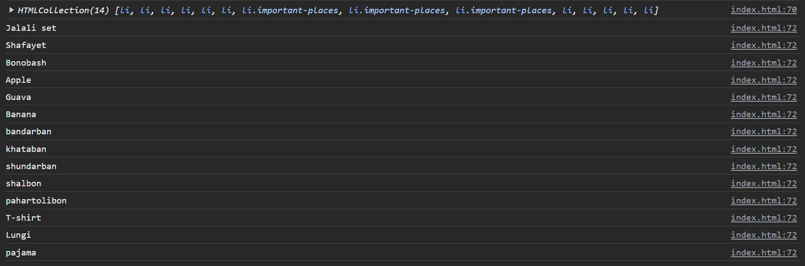
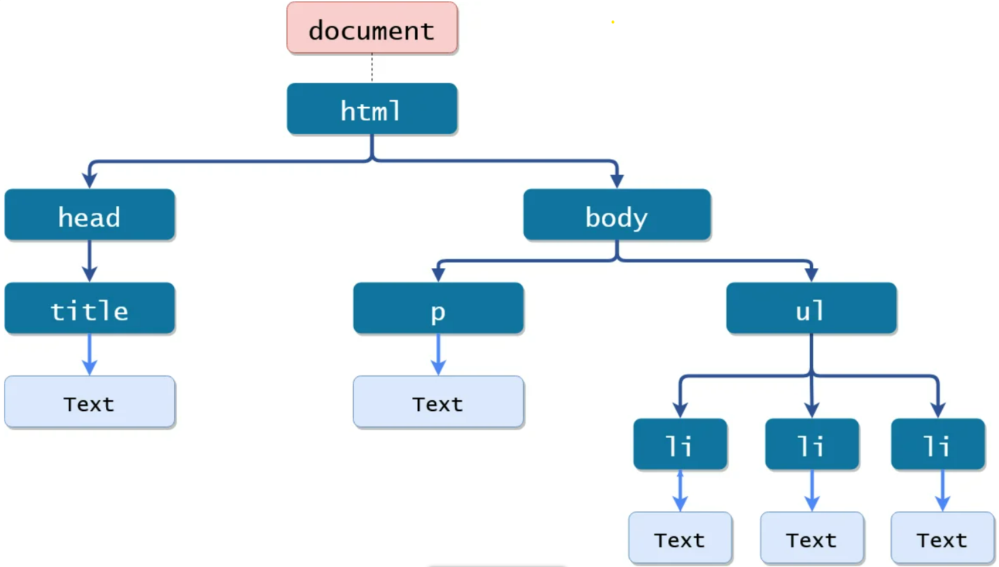
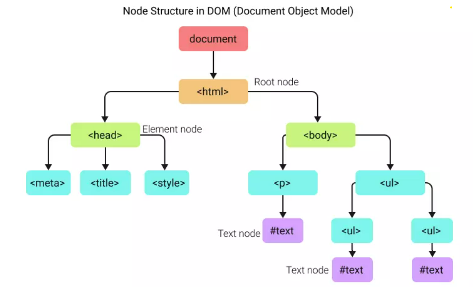

# Table of Contents
- [DOM](#dom)
  - [DOM node, NodeList, htmlcollection, parentNode, childnodes, createElement](#dom-node-nodelist-htmlcollection-parentnode-childnodes-createelement)
  - [What can JavaScript do with DOM?](#what-can-javascript-do-with-dom)
- [Event, addEventListener, Event bubble](#event-addeventlistener-event-bubble)
  - [What is Event, different types of event in web](#what-is-event-different-types-of-event-in-web)
# DOM
## What's DOM defines?
- DOM stands for: Document(file) object(elements) Model(layout structure)

- `Why DOM:` DOM এর দ্বারাই JavaScript খুব সহজে HTML Elements গুলোকে Manipulate করতে পারে
- JavaScript Dom/document এর সাহায্য HTML এর প্রতিটা element কে manipulate করে |
- HTML এর element গুলিকে DOM এর সাহায্য Objects  বানিয়ে JavScript manipulate করে
- DOM হচ্চে HTML document এর জন্য একটা programming Interface
- We can imagine DOM as a tree structure.
- যখন webpage browser এ Load হয় তখন HTML document টা DOM Tree তে Convert হয় 
  - Example:
  `Input:`
  ```sh
  const liCollection = document.getElementsByTagName("li");
      console.log(liCollection);
  ```
>`output`: Array Like object

  - In More:
  `Input::`
  ```sh
  const liCollection = document.getElementsByTagName("li");
      console.log(liCollection);
      for (const li of liCollection) {
        console.log(li);
      }
  ```
  `Output:`
  
  - In More More Details:
  `Input::`
  ```sh
  const liCollection = document.getElementsByTagName("li");
      console.log(liCollection);
      for (const li of liCollection) {
        console.log(li.innerText);
      }
  ```
  `Output:`
  



## What can JavaScript do with DOM? 
- JavaScript can change all the HTML elements in the page.
- JavaScript can change all the HTML attributes in the page.
- JavaScript can change all the CSS styles in the page.
- JavaScript can remove existing HTML elements and attributes 
- JavaScript can new HTML elements and attributes
- JavaScript can react to all existing HTML events in the page.
- The events for all HTML elements
- The Properties of all HTML elements
- The methods to access all HTML elements
  - `DOM methods:` DOM মেথডগুলো দ্বারা আমরা JavaScript দিয়ে HTML Eelement গুলোকে Manipulate(add,delete,remove,modify,etc) করতে পারি ।
- All Elements as objects

## Find the HTML element in 4 ways
1. getElementById
2. getElementByClassName
3. getElementByTagName
4. querySelector & querySelectorAll
## Dynamic style, getAttribute, setAttribute, innerText, innerHTML
- `style:` document.getElementById("myH1").style.color = "red";
- `getAttribute:` let text = element.getAttribute("class");
- `setAttribute:` element.setAttribute("class", "democlass");
- `innerText:` let text = element.innerText;
- `innerHTML:` document.getElementById("demo").innerHTML = "I have changed!";
- `innerHTML:` document.getElementById("demo").innerHTML = "<p>I have changed!</p>";
## Styling dom properties, add and remove css class using JS
```sh
const sections= document.querySelectorAll('section');
for (const section of sections){
   section.style.border= '3px solid blue';
   section.style.marginBottom='5px';
   section.style.borderRadius='15px';
   section.style.paddingLeft='7px';
   section.style.background='lightgray';
}
/* const placesContainer=document.getElementById('places-container');
placesContainer.style.background='blue'; */

/* Add,remove class */
const placesContainer=document.getElementById('places-container');
placesContainer.classList.add('yellow-bg');
placesContainer.classList.remove('large-text');
```
## DOM node, NodeList, htmlcollection, parentNode, childnodes, createElement
- `node:` NODES দিয়ে DOM tree বানানো হয় | Node হচ্ছে Objects | DOM tree তে Document,Doctype,elements, text গুলোকে nodes বলে ...

- `DOM node:` Tags are element nodes (or just elements) and form the tree structure: `<html>` is at the root, then `<head>` and `<body>` are its children, etc. The text inside elements forms text nodes, labelled as #text . A text node contains only a string. It may not have children and is always a leaf of the tree.
- `NodeList:` Elements_NODE,ATTRIBUTE_NODE,TEXT_NODE etc.
- `childNodes:` const nodeList = document.body.childNodes;let numb = document.getElementById("myDIV").childNodes.length; let text = document.getElementById("mySelect").firstChild.text;
let text = document.getElementById("mySelect").childNodes[2].text; let text = document.getElementById("mySelect").childNodes[2].childNodes[0].text;
- `createElement:` const para = document.createElement("p"); para.innerText = "This is a paragraph";document.body.appendChild(para);
or,
const para = document.createElement("p");
para.innerHTML = "This is a paragraph.";
document.getElementById("myDIV").appendChild(para);
- `parentNode:` let name = document.getElementById("myLI").parentNode.nodeName;
## Create HTML elements using Javascript and appendChild
```sh
/* ===Example-1======== */
//step-1:where to add
const placesList=document.getElementById('places-list');
// step-2: what to be added
const li=document.createElement('li');
li.innerText='pahartolibon';
// step-3: add the child
placesList.appendChild(li);

/* ===Example-2======== */
// 1-where to add
const mainContainer=document.getElementById('main-content');
// 2-what to be added 
const section=document.createElement('section');
mainContainer.appendChild(section);
const h1=document.createElement('h1');  //what to add
h1.innerText='My food list';
section.appendChild(h1);

/* ===Example-3======== */
//set inner html directly
const sectionDress=document.createElement('section');
sectionDress.innerHTML=`
<h1>My dress section</h1>
<ul>
  <li>T-shirt</li>
  <li>Lungi</li>
  <li>pajama</li>
</ul>
`
mainContainer.appendChild(sectionDress);
```
# Event, addEventListener, Event bubble
## When to use what:
  - `onClick():` যখন তুমি কোনো simple একটা sinario নিয়ে কাজ করছো এবং একটি HTML element এর জন্য শুধুমাত্র একটি click event নিয়ে কাজ করতে হবে, তখন onClick() ব্যবহার করা তোমার জন্য better option হবে।
  - `addEventListener() :`যখন তুমি তোমার event গুলোর উপর আরও বেশি নিয়ন্ত্রণ চাচ্ছ। This is especially useful when you need to handle multiple events on the same element, or when you might need to remove event handlers later. It's a more robust approach that allows for greater flexibility and cleaner code.
- More in Details:
  - [Source](https://chaytisaha98.medium.com/onclick-vs-addeventlistener-6f4cb4a7557f)
## What's event in JS? Find buttons with event handlers 
- An Event handler is a routine that deals with the event, allowing a programmer to write code that is executed when the event occurs with the help of event attributes.
## event bubbling, event capturing, stop  propagation and event delegation
- event capturing is the event starts from top element to the target element.
- The stop propagation() method of the event interface prevents further propagation of the current event in the capturing and bubbling phases.

## some javascript events:
  - ONCHANGE
  - ONCLICK
  - ONMOUSEOVER
  - ONKEYDOWN
  - ONBLUR
  - ONLOAD
## What is Event, different types of event in web
1. Direct Use:
   - `<button onclick="console.log(7)">Click Me</button>`
   - `<button onclick="document.body.style.background='yellow'">Make yellow</button>`
2. Using Function with declaration:(usable)
   - step-1: `<button onclick="makeRed()">Make red</button>`
   - step-2:`function makeRed() {document.body.style.background='red';}`
3. Using Function without declaration:
    ```sh
    const makeBlueButton=document.getElementById("make-blue");
            makeBlueButton.onclick=makeBlue;

            function makeBlue() {
                document.body.style.background='blue';
            }
            or,
    const purpleButton=document.getElementById('make-purple')
    purpleButton.onclick=function makePurple(){
      document.body.style.background='purple';
    }
    ```
4. Using addEventListener:
```sh
const pinkBtn=document.getElementById('make-pink');
pinkBtn.addEventListener('click',makePink);
function makePink(){
  document.body.style.backgroundColor='pink';
}

or(shorthand),
const greenBtn=document.getElementById('make-green');
greenBtn.addEventListener('click',function makeGreen(){
  document.body.style.backgroundColor='green';
})

or(finally most usable shorthand),
/* option-4: final onclick (important we will use it) */
document.getElementById('make-goldenRod').addEventListener('click',function (){
    document.body.style.backgroundColor='goldenrod';
  })
```
> The following