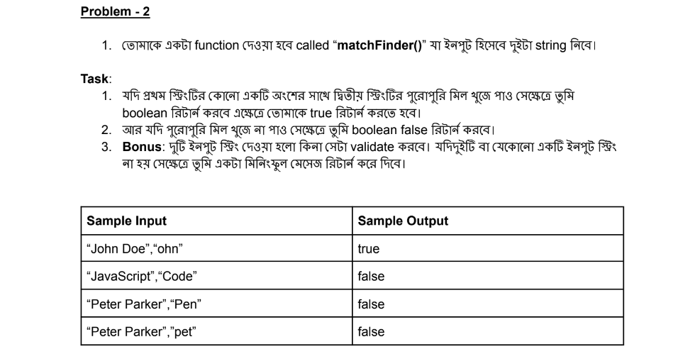

# Table of contents
- [Assignment-4 batch-8](#assignment-4-batch-8)

# Take Challenges: Be a problem Solver

# Assignment-4 batch-8
1. Problem-1:
- 
```sh
function cubeNumber(number) {
    if(typeof number !=='number')
    {
      return 'Please enter a number';
    }else{
        const num= number**3;
        return num;
        }
}
const num="asf";
const result=cubeNumber(num);
console.log(result);
```
2. Problem-2:
- 
```sh
function matchFinder(string1, string2) {
    if (typeof string1 !== 'string' || typeof string2 !== 'string') {
        return 'Please enter both strings as input.';
    } else {
        const doesExist = string1.toLowerCase().includes(string2.toLowerCase());
        return doesExist;
    }
}

const getString1 = 'hi, I am Bariul';
const getString2 = 'be';
console.log(matchFinder(getString1, getString2)); 
```
3. Problem-3:
- 
```sh
function sortMaker(arr) {
    if(0<arr[0,1] && arr[0]!=arr[1]  ){
        return arr.sort(function(a, b){return b-a});
    }else if(arr[0]==arr[1]){
        return "equal";
    }else{
        return 'Invalid input';
    }
}
console.log(sortMaker([55,-55]))
```
4. Problem-4:
- 
```sh
function findAddress(obj) {
    const properties = ['street', 'House', 'society'];
    const formattedObj = properties.map((key) => (obj[key] ? obj[key] : '__'));
    return formattedObj.join(',');
 }
 
 const inputObject = { street: 'ROAD-1', House: '32', society: 'g' };
 const output = findAddress(inputObject);
 console.log(output); 
```
5. Problem-5:
- 
```sh
function canPay(changeArray,totalDue  ) {
    if (!changeArray.length){
      console.log('Please come with money');
    }else{
      total=0;
      for(let i=0;i<changeArray.length;i++){
        const taka=changeArray[i];
        total=total+taka;
      }
      if(total>=totalDue){
        return true;
      }else{
        return false;
      }
    }
    }
    const arr=[]
    const num=10;
    console.log(canPay(arr,num)) 
```